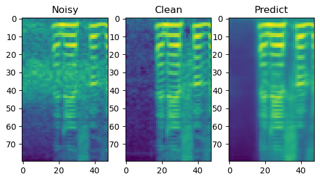

# Тестовое задание Александра А.
## Задание 1
Скрипт Task 1
## Задание 2.1 (Классификация):
  1) Скрипт для обучения Task 2.1 - Train. При запуске указать верный путь до частей датасета
  2) Скрипт для тестирования Task 2.1 - Test. При запуске указать верный путь до тестовой выборки. В качестве примера здесь используется часть от тренировочной       выборки, которая была сохранена в отдельный файл в предыдущем скрипте. Показатель accuracy 0,978.
## Задание 2.2 (Denoising):
  1) Скрипт для обучения Task 2.2 - Train. При запуске указать верный путь до частей датасета
  2) Скрипт для тестирования Task 2.2 - Test. При запуске указать верный путь до тестовой спектограммы.

